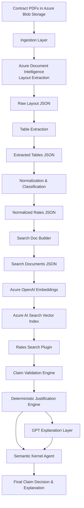

# ContractIQ

## 📌 Overview
This project is a **production-grade contract-aware claim validation system** built on Azure services. It ingests healthcare contracts (PDFs), extracts and normalizes rate tables, indexes them into Azure AI Search with vector embeddings, and validates pharmacy claims using deterministic rules with optional GPT-based explanations.

The system follows **regulator-grade architecture principles**:
- Deterministic logic for decisions
- LLMs used only for explanation
- Full traceability from claim → contract → rule → decision

---

## 🧭 End-to-End Flow Diagram



---

## 🏗️ System Architecture (Layered)

### **Step 1–2: Ingestion & Layout Extraction**
- PDFs stored in **Azure Blob Storage**
- Azure Document Intelligence extracts layout, tables, and text
- Output: `data/raw_layout/*.json`

### **Step 3: Table Extraction**
- Tables extracted from layout JSON
- Output: `data/extracted_tables/*_tables.json`

### **Step 4: Classification & Normalization**
- Detects:
  - Non‑Specialty base rate tables
  - Specialty category tables (IVIG, Hemophilia, etc.)
- Produces normalized, machine‑readable rates
- Output: `data/normalized_rates/rates_normalized.json`

### **Step 5: Search Document Construction**
- Each rate → one search document
- Adds structured fields + human‑readable text
- Output: `data/search_docs/rate_search_docs.json`

### **Step 6–7: Vector Indexing (Azure AI Search)**
- Azure AI Search index with:
  - Filterable metadata
  - Searchable text
  - Vector field `text_vector` (1536‑dim)
- Embeddings generated using **Azure OpenAI**
- Documents uploaded to index `contract-rates`

---

## 🧮 Claim Validation Engine (Step 9A)

### Deterministic Logic (Regulator‑Grade)
- Input: ClaimLine
- Retrieves best matching contract rate via hybrid search
- Calculates expected reimbursement
- Computes variance
- Outputs:
  - OK / MISMATCH
  - Expected vs Paid
  - Applied rule

### Deterministic Justification Engine
Produces structured, auditable explanations:
```json
{
  "status": "MISMATCH",
  "reason": "Underpayment detected",
  "expected_amount": 1180.0,
  "paid_amount": 820.0,
  "difference": 360.0,
  "rule_applied": "MedicareContract.pdf | IVIG Products | 18% Brand WAC"
}
```

This layer is **mandatory for compliance**.

---

## 🤖 GPT Explanation Layer (Step 9B)

- Consumes deterministic outputs only
- Generates human‑readable narrative
- Does **not** influence decisions

Example:
> "The claim was underpaid by $360 because the Medicare IVIG specialty rule applies an 18% Brand WAC discount with no dispensing fees."

Used for:
- Support teams
- Business users
- Faster understanding

---

## 🧠 Semantic Kernel Agent (Option 10D)

The SK Agent orchestrates:
1. Claim intake
2. Rate retrieval plugin
3. Validation engine
4. Deterministic justification
5. GPT explanation

Final output is a **single coherent response** suitable for APIs or UI.

---

## 📂 Repository Structure

```
ContractIQ/
│
├── ingestion/            # Blob + Document Intelligence
├── normalization/        # Table extraction & rate normalization
├── search/               # Index creation, embedding, upload, tests
├── claims/               # Claim models, calculators, parsers
├── plugins/              # Search & claim validation plugins
├── agent/                # Semantic Kernel orchestration
├── data/                 # All intermediate JSON artifacts
├── .env                  # Azure configuration
└── requirements.txt
```

---

## ✅ Key Design Principles
- **LLMs never make financial decisions**
- **All decisions are reproducible & auditable**
- **Search + Vector hybrid for accuracy**
- **Clear separation of concerns**

---

## 🚀 Next Possible Enhancements
- Evidence packs with PDF page references
- Batch claim validation
- REST API / UI dashboard
- Human‑in‑the‑loop review workflows

---

## 🏁 Final Note
This architecture mirrors how **real healthcare, fintech, and insurance platforms** operate in production. You now have a strong foundation suitable for enterprise deployment, demos, or portfolio use.

